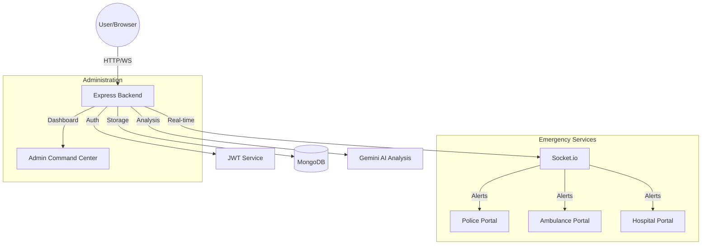
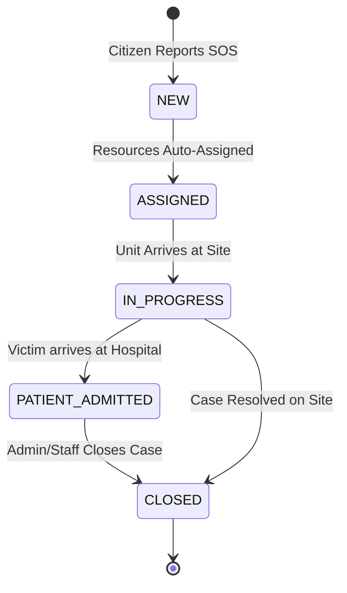
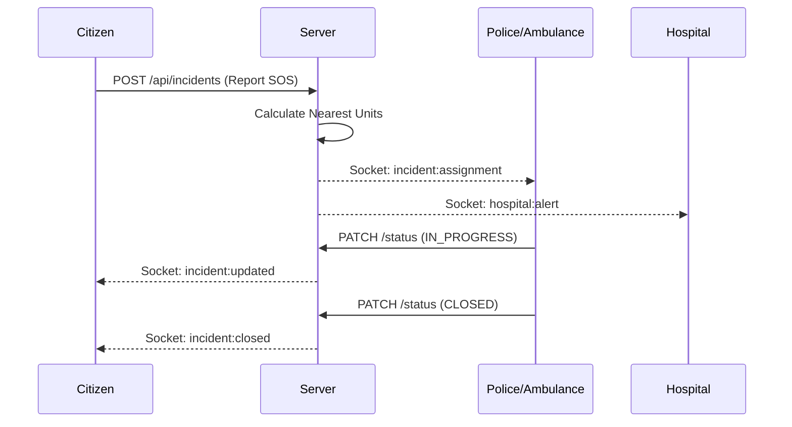

# Software Requirements Specification (SRS)
## Highway Accident Emergency Response Management System (HAERMS)

---

## 1. Introduction
### 1.1 Purpose
The purpose of this document is to provide a detailed description of the HAERMS (Highway Accident Emergency Response Management System). It outlines the functional and non-functional requirements, system architecture, and operational workflows for all stakeholders.

### 1.2 Scope
HAERMS is a centralized web-based platform designed to minimize emergency response times for highway accidents. It connects Citizens, Patrol Units (Police), Ambulance Services, and Hospitals through a real-time command center.

### 1.3 Definitions & Abbreviations
- **SOS**: Save Our Ship/Souls (Emergency signal)
- **JWT**: JSON Web Token (Authentication)
- **MDB**: MongoDB (Primary Database)
- **Socket.io**: Real-time bidirectional event-based communication
- **Gemini**: Google's AI model used for incident analysis

---

## 2. Overall Description

### 2.1 Product Perspective
HAERMS serves as a bridge between the accident site and emergency services. It utilizes geospatial data (Leaflet.js) and real-time communication (Socket.io) to ensure immediate resource distribution.

### 2.2 User Classes & Characteristics
- **Citizens**: Report incidents via SOS, view nearby resources, and track their reported cases.
- **Police (Patrol Units)**: Receive incident assignments, navigate to sites, and update case status.
- **Ambulance Service**: Transport victims to hospitals, provide real-time patient status updates.
- **Hospital Staff**: Manage bed availability and prepare for incoming emergencies.
- **Administrators**: Oversee the entire system, manage staff accounts, and analyze system performance via AI.

### 2.3 System Architecture

---

## 3. System Features

### 3.1 Incident Reporting (SOS)
- **Functionality**: Citizens can report an accident with a single click.
- **Workflow**: Captures GPS location, accident type, and severity.
- **Auto-Assignment**: System automatically alerts the nearest Police and Ambulance units based on Haversine distance calculations.

### 3.2 Real-Time Command Center
- **Functionality**: Admins view a live map of all active incidents and unit locations.
- **Staff Management**: Admins can create, edit, and update staff accounts (Police, Ambulance, Hospital).
- **Live Analytics**: Real-time distribution charts (Pie Chart) of incident types.

### 3.3 AI-Powered Analysis
- **Functionality**: Uses Google Gemini to analyze incident reports.
- **Output**: Generates executive summaries, performance ratings, risk assessments, and recommendations for future safety improvements.

### 3.4 Workflow State Machine

---

## 4. Operation Models

### 4.1 Incident Response Sequence

---

## 5. Specific Requirements

### 5.1 Technology Stack
- **Frontend**: Vanilla HTML5, CSS3 (Premium Glassmorphism Design), JavaScript (ES6+).
- **Backend**: Node.js, Express.js.
- **Database**: MongoDB (Atlas).
- **Real-time**: Socket.io.
- **Mapping**: Leaflet.js / OpenStreetMap.

### 5.2 Security Requirements
- **Authentication**: JWT-based stateless authentication.
- **Authorization**: Role-Based Access Control (RBAC) enforced via middleware.
- **Data Integrity**: Passwords hashed using Bcryptjs.

### 5.3 Performance Requirements
- **Latency**: API responses under 200ms for core emergency routes.
- **Concurrency**: Support for 100+ simultaneous real-time connections via WebSockets.
